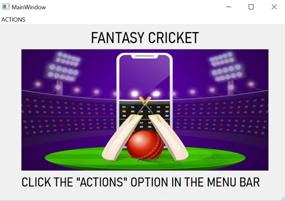
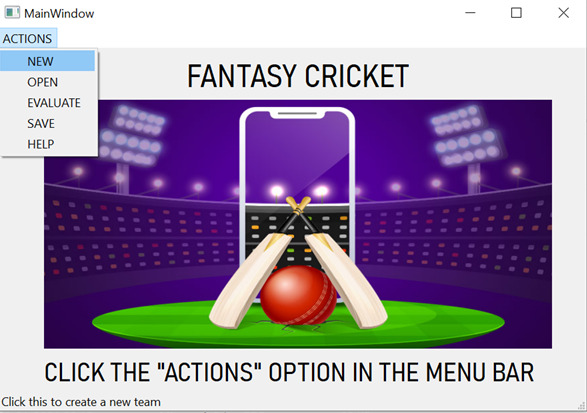
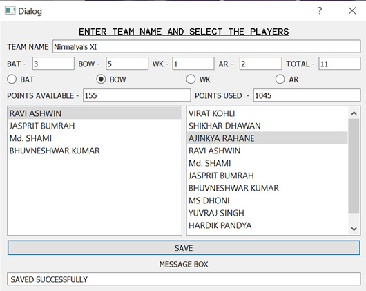
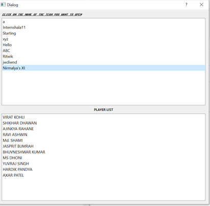
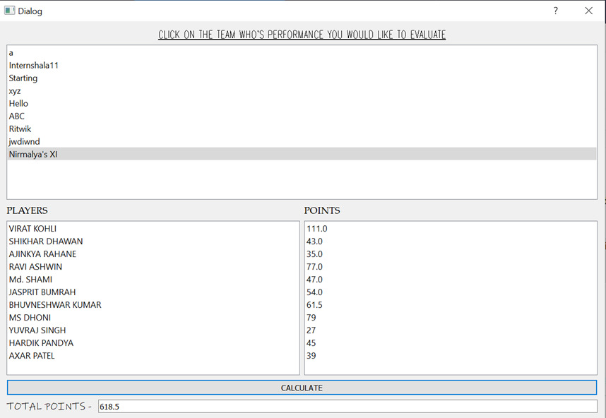

# Fantasy-Cricket-in-Python-GUI-
This is a Fantasy Cricket Project in Python. It uses PyQT5. SQLite databases are also used in this project. One can create a team, save it, open an existing team and evaluate the performance of the team.

# Landing Page 

I took an image from Google Images and put it into the project. On running the file StartW(1).py , we get this window. The window contains an image and an `ACTIONS` tab. Going to the Actions tab , we will get something like this:

As we can see there are five options `NEW` , `OPEN` , `EVALUATE` , `SAVE` and `HELP`. These are basically self explanatory. `NEW` helps us to create a new team. `OPEN` will let us open an existing team. `EVALUATE` will check the performance of a team. `HELP` and `SAVE` have instructions and Option for saving teams respectively. 

# Creating a new team

As it can be seen, we have to name the team and then choose the type of player we want. Then, from the left list we have to select players. The right list is our team.
On clicking `SAVE`, the team is either Saved successfully or an error message is displayed in the Message Box.

# Opening an existing team

In this window, we have to click the name of the team we created out of the many already created teams and check the players in the team.

# Evaluating a team

Here, we can choose a team, and the players and the points they earned in a match is displayed. On clicking CALCULATE, the total points is displayed

# Future prospects
This project can be further improved by adding an EDIT feature to edit already created teams. Also, a feature can be added to compare the performances of two different teams, and a leaderboard can be created. 
